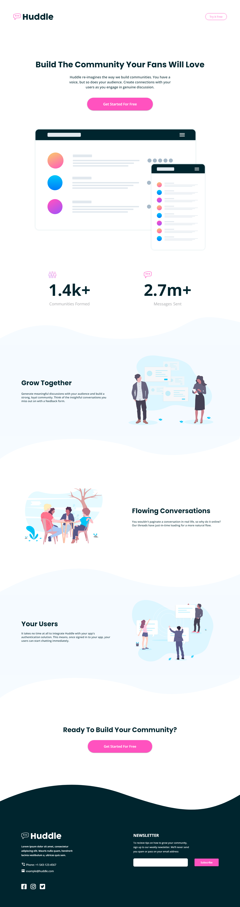

# Frontend Mentor - Huddle landing page with curved sections solution

This is a solution to the [Huddle landing page with curved sections challenge on Frontend Mentor](https://www.frontendmentor.io/challenges/huddle-landing-page-with-curved-sections-5ca5ecd01e82137ec91a50f2). Frontend Mentor challenges help you improve your coding skills by building realistic projects. 

## Table of contents

- [Overview](#overview)
  - [The challenge](#the-challenge)
  - [Screenshot](#screenshot)
  - [Links](#links)
- [My process](#my-process)
  - [Built with](#built-with)
  - [What I learned](#what-i-learned)
  - [Continued development](#continued-development)
  - [Useful resources](#useful-resources)
- [Author](#author)

## Overview

### The challenge

Users should be able to:

- View the optimal layout for the site depending on their device's screen size
- See hover states for all interactive elements on the page

### Screenshot



### Links

- Solution URL: [Solution](https://github.com/JustANipple/huddle-landing-page-with-curved-sections/blob/master/style.css)
- Live Site URL: [Live site](https://your-live-site-url.com)

## My process

### Built with

- Semantic HTML5 markup
- CSS custom properties
- Flexbox
- CSS Grid
- Mobile-first workflow
- Josh's Custom CSS Reset
- Fontawesome icons
- Pseudo-classes
- Responsive images

### What I learned

You can use a picture element to make wave images change based on view width

This is a part of the first waves:
```css
  <picture class="top-wave-img">
    <source 
    media="(max-width: 375px)"
    srcset="images/bg-section-top-mobile-1.svg">
    <source 
    media="(min-width: 376px)"
    srcset="images/bg-section-top-desktop-1.svg">
    
  </picture>
```

### Continued development

Structuring this page with all the waves made hard organizing spaces. I realized later that i could've used a wave for every section to make them the same height, making it easier to gap them using grids
I'll work harder on these projects to train my eyes to see these patterns

### Useful resources

- [Responsive waves](https://developer.mozilla.org/en-US/docs/Learn/HTML/Multimedia_and_embedding/Responsive_images?retiredLocale=it) - With this i learned to use srcset to list more images based on the view width

## Author
- Frontend Mentor - [@JustANipple](https://www.frontendmentor.io/profile/JustANipple)
